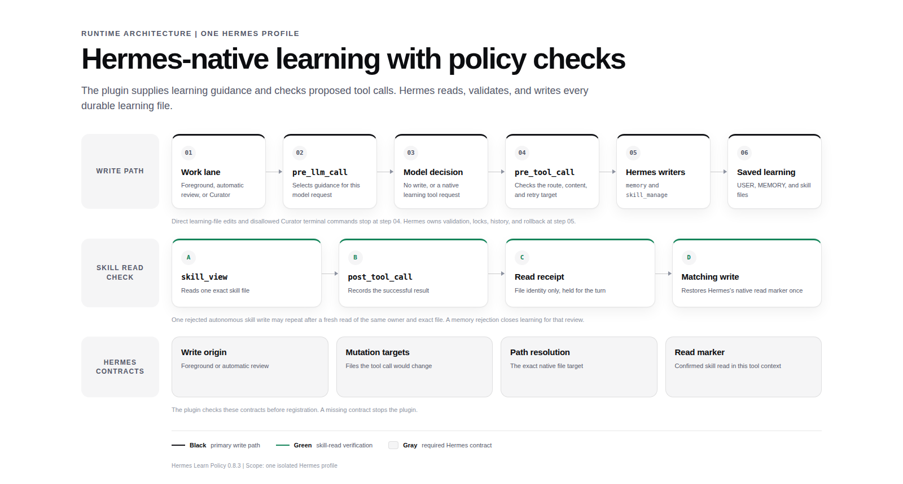

# Architecture

[Open the full-size HTML diagram](architecture.html).

## Responsibilities

| Responsibility | Owner | Lifetime |
|---|---|---|
| Select learning guidance for the current work type | Hermes Learn Policy | Current model request |
| Allow or block selected tool calls | Hermes Learn Policy, enforced by Hermes | Current tool call |
| Record exact skill reads and autonomous retry state | Hermes Learn Policy | Current process and turn |
| Save USER and MEMORY facts | Hermes `memory` | Durable |
| Read skill files | Hermes `skill_view` | Current tool result |
| Update skill files | Hermes `skill_manage` | Durable |
| Validate paths and content, lock files, record history, and roll back writes | Hermes | Durable operation |

## Hooks

### `pre_llm_call`

Hermes identifies the work as foreground, automatic review, or Curator maintenance. The hook returns the matching learning guidance for the current model request.

### `pre_tool_call`

Before selected tools run, the hook checks:

- direct edits to learning files;
- obvious private-key text in proposed learning;
- Curator terminal commands;
- autonomous retry ownership and target;
- a confirmed read of the skill file being updated.

For a matching skill update, the plugin restores Hermes's native skill-read marker in the current tool context. Hermes then applies its normal checks. Other calls either continue unchanged or receive a specific `learning-policy` block reason.

### `post_tool_call`

After a selected tool finishes, the hook records a successful read of one exact skill file. During autonomous work, it also records the first rejected memory or skill write. It does not alter the tool result.

## Skill-read bridge

Hermes records background skill reads in a Python `ContextVar`. A later tool call may run in another execution context and miss that marker even after `skill_view` succeeds.

The plugin records the resolved path from the successful read result. When the matching write begins, it restores Hermes's marker in that tool context. Hermes still performs the update through `skill_manage` and applies every native check.

The plugin does not store skill text or call a private Hermes writer.

## Autonomous retry

Automatic review and Curator may retry one rejected skill write:

1. Hermes rejects the write.
2. The same skill owner and exact file must be read again.
3. One matching retry may continue.
4. Success or another rejection closes learning writes for that review.

Changing the owner or file does not create another attempt. A rejected memory write closes learning writes immediately. Foreground user-directed learning does not use this retry limit.

## Short-lived state

The plugin keeps three maps keyed by session and turn:

- current work type;
- confirmed skill reads;
- rejected writes and retry use.

Each map holds at most 256 entries. A new turn removes older entries from the same session but never evicts active work from another session. If the maps are full, automatic learning stops until a fresh turn frees capacity.

The maps store lane names, owner and target hashes, and resolved file paths. They do not store prompts, memory text, skill text, full tool requests, credentials, or durable records.

## Hermes dependencies

`gate.py` uses Hermes's public `get_hermes_home()` function so checks follow the active profile, including profiles served by a shared gateway.

`compat.py` keeps four version-dependent Hermes adapters in one module:

| Hermes contract | Use |
|---|---|
| Current write origin | Select foreground or automatic-review guidance |
| File mutation targets | Detect direct edits to learning files |
| Native file-path resolution | Check the file Hermes would change |
| Background skill-read marker | Restore one confirmed read in the current tool context |

The plugin checks all four contracts before registering. If any contract is unavailable, registration fails. The compatibility module does not import private learning writers, deleters, validators, or rollback functions.

## Limits

- The plugin is not a sandbox. It runs with the current user's permissions.
- It checks model-requested tool calls, not every internal or manual file write.
- Learning guidance reduces unsupported USER facts but cannot prove the origin of every paraphrased statement. Natural-use testing still matters.
- Curator terminal access uses a fixed list of read-only commands. Git commands are excluded because Git configuration and hooks can execute other programs.

Installation, verification, and removal instructions are in the main [README](../README.md).
