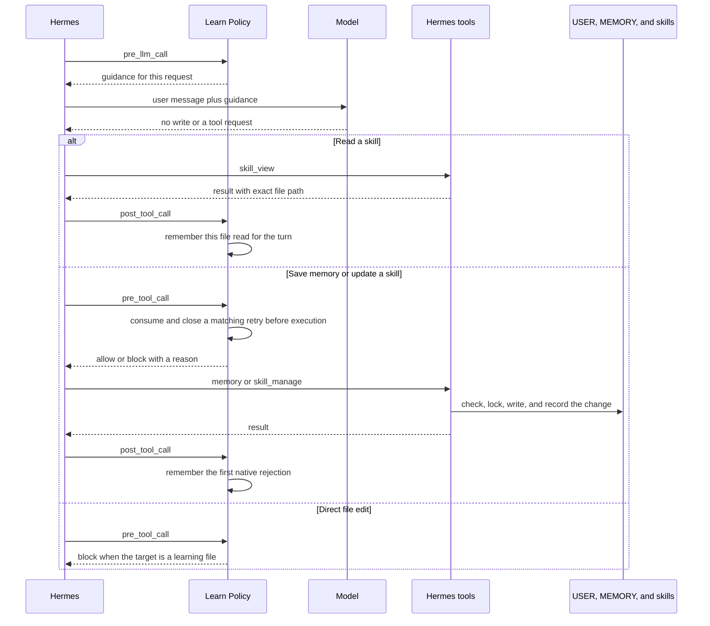

# Architecture

This is the technical page. It should still make sense without a decoder ring.

Hermes Learn Policy adds guidance and checks at three points in the Hermes tool flow. Hermes remains the only part that saves USER facts, MEMORY facts, or skills.

[Open the full-size diagram](architecture.html).

## One profile is shown

The diagram shows one running Hermes profile.

In a multi-agent setup, install the plugin in each profile that should use it. Hermes treats each `HERMES_HOME` directory as a separate profile and loads a separate plugin copy for it. That copy keeps its own short-lived state. This stays true when profiles run as separate processes or when one gateway process serves several profiles, which Hermes calls multiplexing. Nothing in the plugin sends state, memories, or skill content to another agent.

Using the same pinned commit across profiles gives every agent the same rules while keeping each profile independent.

## A few plain terms

- A **hook** is a function Hermes calls at a known point before or after work.
- A **skill-read record** is a short in-memory note that Hermes successfully read one exact skill file.
- A **retry record** remembers one rejected background write for the rest of that turn.
- A **hash** is a one-way file or owner identity. The plugin uses hashes so it does not need to keep learning text in memory.

## Call sequence

## Who owns what

| Job | Owner |
|---|---|
| Load the plugin and call its hooks | Hermes |
| Add guidance to the current model request | Hermes, using the plugin's hook result |
| Save USER and MEMORY facts | Hermes `memory` |
| Read and update skills | Hermes `skill_view` and `skill_manage` |
| Check paths, content, ownership, locks, history, and rollback | Hermes |
| Choose the learning rules, block direct routes, remember exact reads, and limit one retry | Hermes Learn Policy |
| Store the final USER, MEMORY, and skill files | Hermes |

## The three hooks

### `pre_llm_call`

Hermes tells the plugin what kind of work is running:

- a regular user turn;
- an automatic learning review;
- Curator skill maintenance.

The plugin returns the matching guidance. Hermes adds it to the current model request only. The saved user message, earlier conversation, and system prompt stay unchanged.

### `pre_tool_call`

Before selected tools run, the plugin checks:

- whether a background retry still matches the same skill and file;
- whether a file edit is trying to bypass `memory` or `skill_manage`;
- whether Curator is using the shell only to inspect files;
- whether saved learning contains obvious private-key text.

The result is either no objection or a block with a `learning-policy` reason.

If a background skill update follows a confirmed read of the same file, the plugin restores Hermes's built-in "this file was read" marker in the current tool call. Hermes then performs its normal checks.

### `post_tool_call`

After a selected tool finishes, the plugin may remember:

- one successful read of an exact skill file;
- one rejected background memory or skill write.

It does not edit the tool result.

## Why the skill-read record exists

Hermes marks a background skill as read before allowing an update. That mark lives in Python's `ContextVar`, which keeps values local to one execution context.

A later tool call can run in another worker context and miss the mark even though `skill_view` succeeded. The plugin carries only the confirmed file identity into the matching write call, then asks Hermes to restore its own marker there.

The plugin never edits the skill and never calls a hidden Hermes writer.

## One retry, same target

Automatic review and Curator get one recovery chance per turn.

1. Hermes rejects a skill write.
2. The plugin remembers the skill owner and exact file.
3. Hermes must successfully read that same file again.
4. One matching retry may continue.
5. Success or failure ends learning writes for that review.

Changing the filename, switching skills, writing to MEMORY instead, or sending the same request twice does not create another chance. A rejected memory write ends learning writes immediately.

Regular user-directed learning does not use this retry limit.

## Short-lived state

The plugin keeps three small maps in the running process:

- work type by session and turn;
- confirmed skill reads;
- rejected writes and retry use.

Each map is limited to 256 entries. Old turns from the same session are removed when a new turn begins. Active work from another session is never pushed out to make room.

The plugin stores no prompt, memory text, skill text, full tool request, credential, or saved record. If the maps are full, automatic learning is refused until a fresh turn frees space.

## Four narrow Hermes connections

`gate.py` uses Hermes's public `get_hermes_home()` function to follow the active profile, including profiles served by a shared gateway process.

`compat.py` keeps four other connections in one place. Three read information. The fourth restores a short-lived Hermes marker and never writes learning content.

| Hermes connection | Why the plugin needs it |
|---|---|
| Whether the write came from regular work or automatic review | Choose the right guidance and retry rule |
| Which files a proposed edit would change | Catch direct edits to learning files |
| The exact path Hermes resolves for a relative filename | Check the same file Hermes will touch |
| Restore Hermes's skill-read marker | Carry one confirmed read into the current worker context |

The plugin checks all four before registering. If Hermes moves or removes one, the plugin does not start. It never imports a hidden Hermes function that writes, deletes, validates, or rolls back learning content.

## What can change

| Result | How long it lasts | Who creates it |
|---|---|---|
| Learning guidance | Current model request | Plugin result, added by Hermes |
| Allow or block decision | Current tool call | Plugin result, enforced by Hermes |
| Skill-read and retry records | Current process and turn | Plugin memory only |
| USER and MEMORY facts | Saved | Hermes `memory` |
| Skill files and references | Saved | Hermes `skill_manage` |

## Limits

- The plugin is not a sandbox. It runs inside Hermes with the current user's permissions.
- It checks tool calls made by the model. It does not claim control over every internal or manually performed file write.
- The USER guidance reduces the chance that review instructions become fake user preferences. A prompt cannot mathematically prove where every paraphrased idea came from, so natural-use tests still matter.
- Curator shell access uses a short list of read-only commands. Git is excluded because local Git settings can run other programs even during commands that look read-only.

Operational update checks and removal commands live in the main [README](../README.md).
